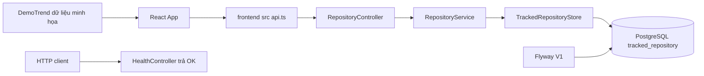
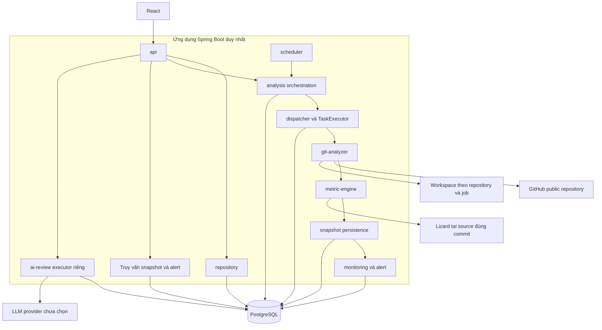
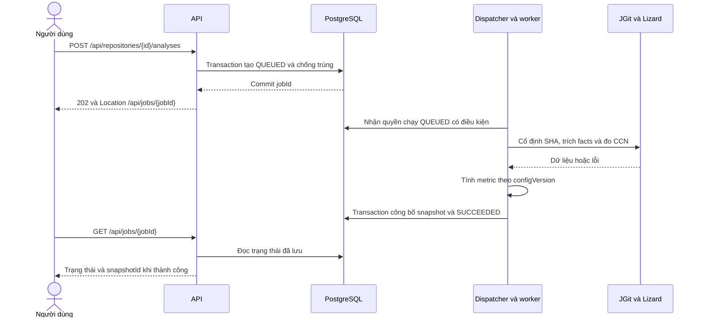

# Kiến trúc Git Health Monitor

Ngày soạn: 08/10/2026. Phạm vi: tuần 4 của Tưởng, trên code cơ sở `6560cb1`.

**Trạng thái: đề xuất để Tưởng và Toản review; chưa được GVHD phê duyệt, chưa cài đặt pipeline.** Baseline thuật toán là [Metric Specification v1](metric-spec-v1.md).

## 1. Hiện trạng có trong source

| Thành phần | Bằng chứng | Giới hạn |
|---|---|---|
| API đăng ký, danh sách, chi tiết | `backend/src/main/java/com/example/demo/repository/RepositoryController.java` | Chưa clone/xác minh repo tồn tại hoặc công khai |
| Chuẩn hóa và lưu URL | `GitHubRepositoryUrl`, `RepositoryService`, `TrackedRepositoryStore` trong package repository | Chỉ quản lý địa chỉ repository |
| Database | `backend/src/main/resources/db/migration/V1__create_tracked_repository.sql` | Chưa có bảng job/snapshot/metric |
| UI gọi API | `frontend/src/App.tsx`, `frontend/src/api.ts` | Đăng ký/danh sách; DemoTrend vẫn minh họa |
| Health | `HealthController.java` | OK không chứng minh DB/pipeline khỏe |

Backend cần PostgreSQL và DB_*; đăng ký mặc định tắt, Compose bật cho thử nghiệm local. CORS không thay xác thực. Xem [README](../README.md) và [contract tuần 3](week-03/api-contract-week3.md). Không chạy lại test ứng dụng trong đợt soạn tài liệu này.

## 2. Kiến trúc mục tiêu

Một ứng dụng Spring Boot chia module nội bộ; React triển khai riêng; PostgreSQL lưu trạng thái bền vững. Lizard là tiến trình con, không phải microservice. Workspace Git tách khỏi source ứng dụng. Đề xuất giai đoạn đầu chỉ một instance backend; nhiều instance cần thiết kế bổ sung.

| Module dự kiến | Trách nhiệm | Phụ trách đề xuất |
|---|---|---|
| repository, api | Validation HTTP, quản lý repo, DTO cho UI | Toản |
| analysis | Nhận yêu cầu, chống trùng, điều phối job; không chứa công thức | Toản phối hợp Tưởng |
| git-analyzer | Clone/fetch, SHA cố định, commit/diff/rename/tác giả, facts có nguồn | Tưởng |
| metric-engine | Adapter Lizard, tính chỉ số theo spec, cờ dữ liệu thiếu | Tưởng |
| snapshot | Lưu nhất quán, metadata, công bố kết quả hoàn chỉnh | Toản phối hợp Tưởng |
| scheduler, monitoring | Tạo yêu cầu qua cùng service, so snapshot tương thích, sinh alert | Toản; Tưởng review ý nghĩa metric |
| ai-review | Context có nguồn, adapter và validation; không đổi metric | Tưởng; Toản làm API/UI |

Package Java dự kiến: analysis, gitanalyzer, metrics, monitoring, aireview; không dùng dấu gạch nối trong package. Giữ repository hiện có. API gọi application service; metric không gọi controller/JPA/LLM; scheduler không tạo pipeline thứ hai.

## 3. Luồng job bất đồng bộ dự kiến

API trả sau commit job, không đợi phân tích. Poller tìm lại QUEUED sau restart. TaskExecutor thực thi trong bộ nhớ; PostgreSQL giữ trạng thái. Xem [ADR 002](adr/002-no-redis.md).

| Trạng thái | Ý nghĩa | Chuyển trạng thái |
|---|---|---|
| QUEUED | Đã lưu, chờ worker | RUNNING; FAILED nếu quá hạn chờ theo cấu hình |
| RUNNING | Worker có token sở hữu và heartbeat | SUCCEEDED hoặc FAILED |
| SUCCEEDED | CREATED có snapshot mới hoặc NO_CHANGE trỏ snapshot cũ tương đương | Kết thúc |
| FAILED | Lỗi an toàn, không công bố snapshot dở | Kết thúc; retry tạo job mới |

Đề xuất tối đa một QUEUED/RUNNING mỗi repo cho cả API và scheduler. Dùng unique constraint/index có điều kiện ở DB, không chỉ kiểm tra Java. Claim bằng transaction ngắn có điều kiện; chỉ worker claim thành công được chạy. Executor từ chối thì trả QUEUED với kiểm tra token; recovery xử lý crash giữa claim và submit.

Worker cập nhật heartbeat/lease; mọi ghi tiến độ và publication kiểm tra RUNNING/token/lease hợp lệ. Kiểm tra ownership và lease chưa hết trong cùng transaction với publication, dùng thời gian DB. Watchdog chưa chạy không làm lease hết hạn thành hợp lệ. Recovery đổi job hết lease thành FAILED/WORKER_LOST; token cũ không được công bố. Không hứa exactly-once; retry có kiểm soát và không công bố trùng. Poll/heartbeat/lease/số worker/deadline chờ cần chốt sau thử nghiệm.

Timeout clone, process Lizard và toàn job là ba giới hạn riêng. Target ≤10 phút trong spec là mục tiêu benchmark, không tự thành timeout. Trả errorCode, thông điệp an toàn và job ID; không trả stack trace/secret/output process thô. Đóng process/stream và thu hồi workspace theo ownership khi lỗi.

## 4. Hợp đồng dữ liệu Tưởng và Toản

Các trường là đề xuất, chưa phải DTO/schema hiện có. Toản thiết kế ERD/migration tuần 5; Tưởng thiết kế thuật toán/fixture.

| Đối tượng | Trường tối thiểu dự kiến | Luồng |
|---|---|---|
| AnalysisRequest | repositoryId, windowStart/end, configVersion, trigger | API/scheduler → analysis |
| AnalysisContext | jobId, repositoryId, resolvedBranch, commitSha, window, configVersion, claimToken | orchestration → pipeline |
| FileChangeFact | commitSha, parentSha, authorKey, commitTime, oldPath/newPath, changeType, additions/deletions, logicalFileId | ingestion → persistence/metric |
| ComplexityResult | commitSha, logicalFileId, maxCcn, avgCcn, functionCount, nloc, parseStatus, toolVersion | Lizard adapter → metric |
| MetricResult | file ID, frequency, churn, HHI, complexity, percentiles, hotspot, qualityFlags; coupling pairs riêng | metric → persistence |
| SnapshotResult | snapshotId, jobId, SHA, window, configVersion, toolVersions, completedAt | persistence → API/UI |

Đề xuất thời gian UTC và khoảng [windowStart, windowEnd); cần review ở thiết kế thuật toán. Resolve default branch rồi cố định SHA; Lizard đọc source đúng SHA, đặc biệt trong thực nghiệm lịch sử. configVersion là nhãn baseline; effectiveConfigHash (configHash trong API) bao phủ cấu hình hiệu lực, filters, cách chọn commit và tool versions ảnh hưởng metric. Window bounds lưu riêng, không trộn vào hash dùng so tính tương thích công thức.

Đề xuất snapshot identity (repositoryId, headSha, observationStart, observationEnd, effectiveConfigHash). Chỉ tái sử dụng snapshot thành công có toàn bộ identity tương đương; cùng HEAD nhưng khác window/config có thể cần tính lại. Nếu đặc tả cũ bỏ qua chỉ theo HEAD, nhóm ghi nhận thay đổi trước cài đặt.

Facts có thể ghi batch theo jobId; dữ liệu trung gian không xuất như snapshot hoàn chỉnh. Staging trước, transaction ngắn kiểm tra token, công bố snapshot và SUCCEEDED cùng nhau. Không giữ transaction khi clone/Lizard. Unique identity và dọn staging phải thử với retry/crash.

## 5. Baseline và quyết định còn mở

Theo [metric spec](metric-spec-v1.md): default branch, 180 ngày, loại merge, rename detection và chuẩn hóa identity; coupling = shared/min, shared ≥5 và score ≥0,50; HHI theo additions + deletions; complexity là max function CCN; hotspot là căn bậc hai tích percentile. Chưa có ngưỡng HHI cứng. Target ≤10.000 commit trong ≤10 phút chưa benchmark.

Tuần 5 cần chốt: root diff với cây rỗng; rename/copy/delete; timestamp dùng lọc; percentile đồng hạng/một file; file không hàm/parse lỗi; HHI tổng bằng 0; binary/generated; commit sửa hàng loạt; universe file và giới hạn tài nguyên. Không đưa ví dụ ≥3 commit hoặc ≤5 phút trong phân công thành quy tắc chính thức.

Full clone không đồng nghĩa tính mọi commit; phạm vi tải và phạm vi metric khác nhau. Xem [ADR 001](adr/001-full-clone.md).

## 6. API bàn giao và AI

Giữ /api/repositories hiện có. Các route sau theo đề xuất tuần 3, **chưa có handler**, để Toản hoàn thiện contract:

- POST /api/repositories/{id}/analyses: 202 + jobId + Location; 404 repo không có; 409 job đang hoạt động theo đề xuất.
- GET /api/jobs/{id}: status, phase, progress, outcome, errorCode, snapshotId khi có; không đưa phần trăm tiến độ suy đoán.
- GET /api/repositories/{id}/snapshots, GET /api/snapshots/{id}/hotspots, GET /api/repositories/{id}/alerts: dữ liệu đã công bố.

AI theo yêu cầu trên snapshot thành công, executor/quota riêng; không đổi score/nhãn thực nghiệm/source/commit. Xem [AI scope](ai-review-scope.md). Alert dùng metric; đề xuất lỗi alert retry riêng không làm mất snapshot. Chống alert trùng và retry đặc tả tuần 5.

## 7. Vận hành và kiểm chứng dự kiến

Trước khi mở phân tích công khai phải bổ sung kiểm soát truy cập/quota, giới hạn CPU/RAM/disk/process và kiểm tra remote; cờ đăng ký chưa bảo vệ đủ job tốn tài nguyên. Không build/chạy script repo đầu vào. Workspace không dùng trực tiếp path từ client. Lizard dùng danh sách tham số, không ghép shell từ path.

| Mã | Tình huống cần kiểm thử khi cài đặt | Kỳ vọng |
|---|---|---|
| W4-ARCH-01 | Hai yêu cầu cùng repo đồng thời | Một job hoạt động; yêu cầu còn lại xung đột |
| W4-ARCH-02 | API chết sau commit QUEUED | Restart vẫn xử lý được job |
| W4-ARCH-03 | Worker chết/hết lease | Không treo RUNNING, token cũ không công bố |
| W4-ARCH-04 | Clone/Lizard/DB lỗi | FAILED an toàn, không snapshot dở |
| W4-ARCH-05 | Cùng SHA, khác window/config | Không tái sử dụng nhầm snapshot |
| W4-ARCH-06 | Fixture root/merge/rename/nhiều tác giả | Facts/metric khớp tính tay |
| W4-ARCH-07 | AI timeout/sai JSON | Snapshot/metric vẫn dùng được |
| W4-ARCH-08 | Executor từ chối hoặc quá tải | Không mất job; admission/retry có giới hạn |

Đây là tiêu chí tương lai, chưa phải test đã chạy. CI tuần 3 không chứng minh các tiêu chí này đạt.

## 8. Bàn giao và nguồn

Tưởng review module/facts/ADR/metric; Toản review API/transaction/schema/UI và yêu cầu/NFR. Chung: chốt identity/recovery/AI limits. Chưa có biên bản review nhóm.

Nguồn project: [README](../README.md), [contract](week-03/api-contract-week3.md), [spec](metric-spec-v1.md), [use cases](usecases-draft.md). Nguồn kỹ thuật đọc 08/10/2026: [Spring Task Execution](https://docs.spring.io/spring-framework/reference/integration/scheduling.html), [PostgreSQL SELECT](https://www.postgresql.org/docs/18/sql-select.html), [Git clone](https://git-scm.com/docs/git-clone). Recovery/token/publication là thiết kế đề xuất, không có sẵn chỉ nhờ chọn framework.

## 9. Căn chỉnh bản review chung ngày 09/10/2026

Đối chiếu nhánh Toản tại 33fefdd. Kiến trúc Tưởng được kết hợp yêu cầu/API/schema Toản; chưa ghi nhận thành viên đã duyệt. Hợp đồng công khai theo [API contract](api-contract.md), UC theo [requirements](requirements-week4.md); không tạo bộ route/DTO cạnh tranh.

AnalysisRequest HTTP dùng observationDays/configVersion; worker resolve SHA rồi cố định observationStart/End UTC. Context nội bộ có claimToken; commitSha trong facts khác headSha của snapshot. logicalFileId thể hiện bằng fileId ở route. DTO chi tiết tuần 5 cần thống nhất tên trước code; bổ sung analyzedCommitCount/truncated vào metadata snapshot theo contract.

Job dùng phase/progress/outcome; progress=null khi chưa đo được. NO_CHANGE chỉ khi snapshot cũ thành công cùng repository, SHA, cả hai window bounds và effectiveConfigHash/tool versions. Cùng HEAD nhưng cửa sổ trượt vẫn cần tính lại; không ép window cũ để tạo NO_CHANGE. Retry tái lập phải giữ input window cố định.

AI v1 bản review chung chọn POST trả trực tiếp 200 hoặc lỗi theo schema của Toản; không có GET reviewId/202 hoặc lưu output tạm server. Provider chạy trong giới hạn riêng, không ảnh hưởng job metric. Frontend api.ts hiện timeout 15 giây: khi cài AI cần budget riêng 40 giây, backend deadline tổng 35 giây, provider tối đa 30 giây. Đây là thiết kế, chưa sửa code. Cần kiểm tra proxy/host; nếu không hỗ trợ thì mở lại quyết định async/retention thay vì đổi ngầm contract.

BR14 (>30 file), BR16 (10.000 commit gần nhất), pool 2/queue 20 và timing NFR04 là đề xuất Toản cần review, không phải baseline Accepted. Khi chấp nhận phải cập nhật spec/algorithm/config/test. Kiến trúc cho phép truncated/analyzedCommitCount nếu chọn cắt có thông báo; quá giới hạn clone/disk vẫn thất bại an toàn.

Worker hết lease có thể còn chạy: token chỉ chặn publication, không tự dừng process hoặc tránh xung đột cache. Workspace riêng theo job/claimToken; cache Git có khóa phù hợp và checkout SHA cố định. Khi mất lease, worker phải dừng process/IO theo khả năng và mọi ghi kết quả bị chặn nếu mất quyền.
